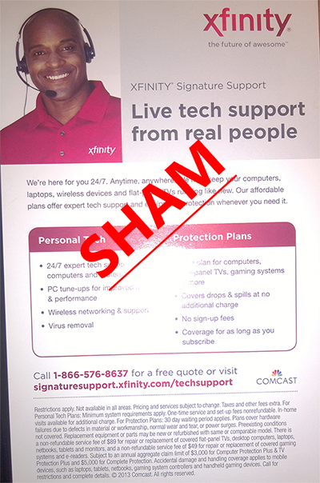

Recently I received a letter in the mail that Xfinity had increased the speed of the internet in my area... SWEET! However I needed to upgrade my modem as it cannot handle the increased speed, sounds reasonable they will send me a new one. This is where the sage begins with my discovery of xfinity's Signature Support Sham and their horrible support and customer service.

# The Story

I received the package fairly promptly and it is a brand new Arris TG862G/CT. I hooked it up with little issue aside from having to switch all my devices to a new wireless AP.

The next day I continued my efforts in configuring my network which included simply setting up a port forward so I can RDP into my desktop at home from work. As a Technology Specialist at a local IT Consulting and Managed Services company I felt I was more than qualified to implement such a minor change. After having performed the configuration and it not working I felt like an idiot. I continued trouble shooting and decided to disable the firewall on the new gateway. After having performed that change I still  could not RDP into my system. I verified RDP was working within my internal network and decided to go above and beyond and even though it made no sense for this change to work I decided to try Port Triggering. Still no luck, so I resorted to calling the xfinity support.<!--more-->

I explained this issue to their support personnel and was told immediately she would need to escalate the issue. The next department I spoke with ask me to explain my issue again then proceeded to inform me that they would be charging me a $39 setup fee and $15/month for Signature Support. My response was that I do not need Signature Support I need a new gateway that will actually work when I implement the configuration. I spoke with a supervisor and the best they could do was waive the $39 setup fee but still charge me $15 to fix my issue.

I ask them to forward me to a department that could help me but not try to charge me for their device that was not working. I was forwarded to someone who dealt with West Coast clients (I am located in Indiana and they had all my account details already) She informed me she could not help me and forwarded me to the central region. Fantastic I was back to the same automated system I hit when I first called in. I explained the issue and was told they had to escalate it again, and guess what, Signature support wants to charge me again! This time after insulting them and informing them I make more an hour doing their job than they probably do they told me they could charge me a onetime fee of $5. At this point it wasn't about the money it was about sending me a gateway that didn't work and wanting to charge me to “Correctly configure and optimize it.”

I ask to be forwarded to the department where I could file an official complain, I had to wait another 10 minutes to be connected with someone on a VOIP line that was breaking up horribly on their end. How do I know it was their end you ask? I know this because I had already been on my cell phone in the same room for over an hour having no issues communicating with their other departments. She ask for my number to all back and never did. I decided screw it I’ll switch to the old modem so I can at least RDP to my home desktop from work tomorrow. I set it up, internet kicks on, router works fine and guess what… so does RDP. However now my VOIP line from xfinity wasn't giving a dial tone and the light wasn't lite up. I call xfinity again and they say they have re-activated the modem and it should be back up in 15 minutes. I decided since it was 1:30am and I had to be up at 7am to go to my job in IT, it was time for bed.

So the saga goes on about 16 hours later after I get home from work, try rebooting the modem, no luck land line light is still not lite and I resort to calling xfinity again, I speak with someone on their Telephone side, they reboot the modem 3 times and still no luck, so she wants to connect me with Activation, fine anything as long as I can get this old modem that was working perfectly fine a few days ago working again. So I am transferred YET AGAIN! This time the transfer fails and I get booted off with no way to reach the activation line directly. I call the telephone support again and this lady tells me SHE CAN HELP! Looks over ticket, tries rebooting modem again and damn she can’t help. So she wants to send a technician to my house now. Well that is great and all but I work 8am-5:30pm every day. I tell her my story and say I am really getting sick of this shit and seriously considering U-verse at this point. She tells me I can have the technician call you tomorrow, when is best for you, I tell her after 5PM EST I will take a call.

# The Fix

At first I thought I was done for the night and decided to continue the internet research I had begin the night before and stumbled across a community thread about calling a "Gateway" team and having them force the gateway into bridge mode. So I decided lets give this a shot, I hooked up my router to the modem, called their support and didn't tell them anything except for I want my Arris TG862 switched to bridge mode. The first person said NO PROBLEM! He claims to complete the configuration but I see the wifi is still on but internet works. I get off the phone and login to my router and notice it is doubled NAT still.

I decided to call back, told the tech hey I ask for it to be bridged and my router is still being NAT from the Arris device. He looks, performs some more configuration and OMG!! I finally am not double NAT and I can RDP.

# The Conclusion

Overall I am completely discussed at the incompetence of their support team, and the fact that they want to charge to support a feature on their modems that doesn't work. The only way I was able to make this new modem work was by bridging it with my old router that works flawlessly.
