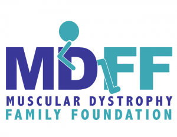

Just over a week ago, I blogged about the [Smart Home I've just started to build](https://mattblogsit.com/oob/building-a-smart-home-focused-on-physical-accessibility). The post seems to have been wildly popular among my friends, with them even engaging and giving me suggestions on how I should do things moving forward.

However, individuals affected with a physical disability are at a significant economic disadvantage. Having the target audience with financial difficulties is the crucial flaw in the article that wasn't addressed. Having a few hundred dollars to spend on Smart Home technology is challenging to come by when facing the financial challenges that someone with a physical disability is likely to experience.

My original approach to this in the article was to approach the Smart Home install by breaking it up into financially digestible chunks that you can afford to implement and spread it out over time. This approach isn't realistic for people with disabilities in the United States who genuinely live paycheck to paycheck and are penalized by trying to save money. There are mechanisms around it, yes, but they are hard to understand and navigate.

So why not share with the people of at least Indiana a resource that I hope they know exists, but I understand they might not!

The Muscular Dystrophy Family Foundation (MDFF) increases the quality of life and independence of people with Muscular Dystrophy, as well as empowers their families, through advocacy, education, and financial resources. You may be asking, ok, how does this help with a Smart Home? Easy, if you have a Muscular Dystrophy and live in the State of Indiana, you can submit an [assistance request](https://forms.office.com/Pages/ResponsePage.aspx?id=p3an6NxT8UywQ1XFKvz46GWkZBG5U3pGo4KLAHiUcwpUQklMWElEVktKMjRQUzRQUkIxWFIzSlBLSS4u) for devices that will increase the quality of life and independence for you (person affected by Muscular Dystrophy).

I want to challenge anyone who has read this article, if you are affected by Muscular Dystrophy and live in Indiana, with an apparent financial strain. [Submit an Assistance Request](https://mdff.org/assistance/) and see if you can start your journey to a Smart Home to make the house more accessible!

If you are not affected with Muscular Dystrophy, and you think someone who is financially disadvantaged and sees the significant quality of life improvements they will receive. I encourage you to [donate to the Muscular Dystrophy Family Foundation](http://mdff.org/make-a-gift/)!

Now, please note. I am on the Board of Directors for the MDFF, so that I may have some bias in this article. However, I genuinely believe I am being 100% transparent and trying to drive our community to improve their independence!
