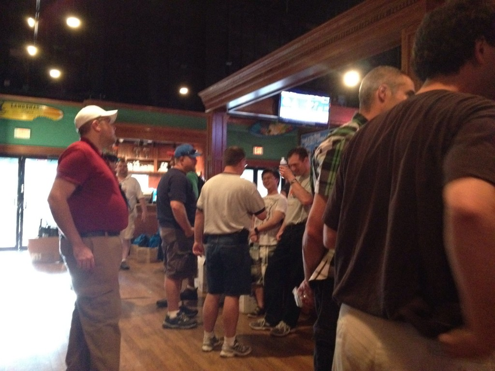

# What is #TheKrewe

“**The Krewe** is a group of hard working/fun-loving IT Pros and Developers. We gather every year at Microsoft TechEd North America, the largest Microsoft technology education conference.  Our mission is to build a dynamic networking community through various activities and gatherings.” – [TechEdKrewe.com](http://www.techedkrewe.com/)

# The Story

In the months leading up to TechEd I decided to become much more involved. I vowed that I was going to Network all throughout TechEd. I posted on #TheKrewe Facebook page which I had been involved with the year before; but did not really network much. I asked how I can break the ice with people when by nature I am not the most social until I know people. Many people told me I was already doing a decent job being involved with #60Days2MCSE, and promoting myself on Twitter before TechEd.

After posting that I was approached by Michael Bender asking if I’d be interested in helping with #TheKrewe Meet N Greet party which was a good time last year, and I was planning on attending anyway. I went ahead and offered to help, and then became the person coordinating the volunteers for the event. It wasn’t much work, and I figured it’d be a good way to get to know more people.

All I had to do was create a sign up form, promote the form and coordinate some people, that’s simple! We also had some emails going back and forth about a #TheKrewe T-shirt, my design abilities and the ones that were already provided I felt could use some improvement. I suggested a T-Shirt Design contest which I took on the lead of. I posted the contest and didn’t get too many entries but we got enough good designs for a really sweet looking shirt.<!--more-->

Once TechEd finally arrived I had no idea what I was doing, I had talked to all of these people on twitter but I didn’t know any faces or names! I didn’t have time at this point to learn them so I was going in blind. I arrived at TechEd and got registered and then went to the Alumni Lounge where I was sitting with me friend, I look over and see people waving… I wasn’t sure if it was at me or someone else. I went ahead and approached them and met my first Krewe members in person. We sat there for about an hour talking about different things before I headed off to join my family for a late lunch.

That evening was #TheKrewe Meet N Greet, upon arrival was the fun of unpacking all of the free stuff for #TheKrewe Survival Pack, once sorted we had to put together an assembly line for 350 bags of free stuff to be completed before the party. I had anticipated only 13 volunteers, when we were going full force we were at 22 volunteers! I was thrilled with the attendance and surprised we had everything completed within 40 minutes and everyone was able to start their party early.

\[caption id="attachment\_51" align="aligncenter" width="620"\] Preparing for #TheKrewe Meet-N-Greet\[/caption\]

During my night at #TheKrewe Meet N Greet I was able to meet many people, and I was excited for the night to begin. I had a chance to hang out with some of the people I had talked with via twitter leading up the the event and I was able to meet new people who I found out live less then 30 minutes from my house. The night ended with me having met many new people and feeling finally like a real #TheKrewe member.

\[caption id="attachment\_52" align="aligncenter" width="1024"\] Calm before the beer\[/caption\]

The week of TechEd went on and every day I saw someone who I had met the first night, and some that I had not but still were coming up and talking to me because of the work I had done. I was really glad to have done what I did and will continue to do such things to maintain these connections and enjoy my time at TechEd.

# The Lesson

Some of you may be unsure if you should be part of #TheKrewe, or what exactly is considered part of #TheKrewe. I would like to tell you now what makes you #TheKrewe is simply joining us, coming up and talking to other Krewe members, and being yourself. We are all nerdy IT people who are horribly awkward sometimes; but that doesn’t mean we cannot talk to each other, that we cannot have fun and above all that we are a community who’s power becomes exponentially stronger with the number of people we know.

# Many Thanks

I cannot forget to thank everyone who made this possible. Michael Bender being the main reason I was able to be so involved this year, all of the volunteers who made #TheKrewe Meet N Greet possible, all of our wonderful sponsors for the event, and last but certainly not least all of #TheKrewe members who make us what we are. We are the best community at TechEd who currently includes about 5% of the attendees of the conference!

# How to Join

Keep in mind we are primarily at TechEd; however we also have members who attend other conferences (even outside of Microsoft) who like to meet up and network. Even if you do not get to consistently attend conferences being part of #TheKrewe is a year around community and we all love to keep in contact so you should always call yourself #TheKrewe!

- Follow us on Twitter [@TheKrewe](http://twitter.com/#!/TheKrewe) or [#TheKrewe](http://twitter.com/#!/search/%23TheKrewe)
- Join us on [Facebook](https://www.facebook.com/groups/TheKrewe/)
